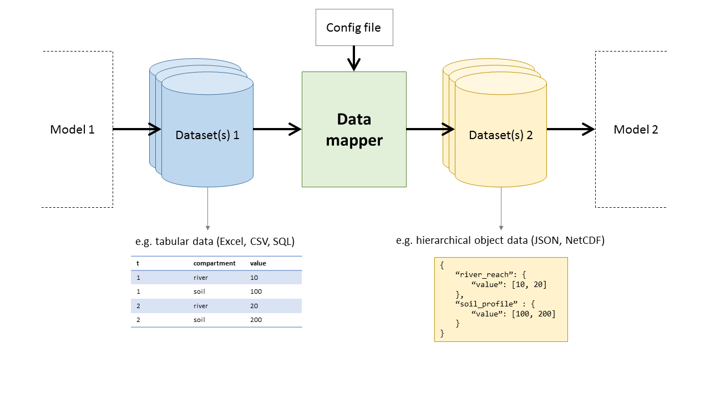

# DataMapper

_No where near production ready. Use at your own risk!_

The goal of this project is to create a module capable of mapping
datasets based on a user-defined configuration file. Format, data structure
and file structure will all be customisable.

Thoughts, comments, suggestions, contribution all welcome! Just open an issue.

